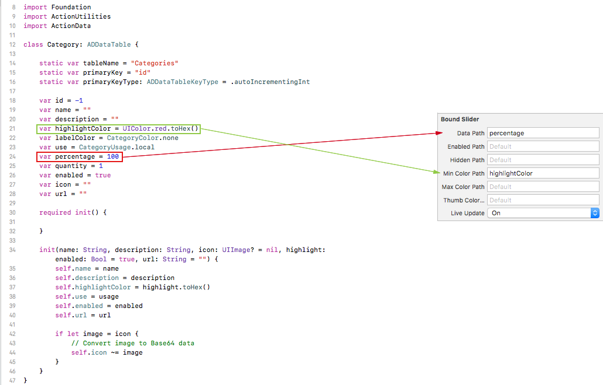
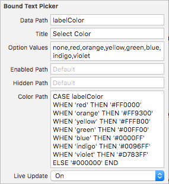
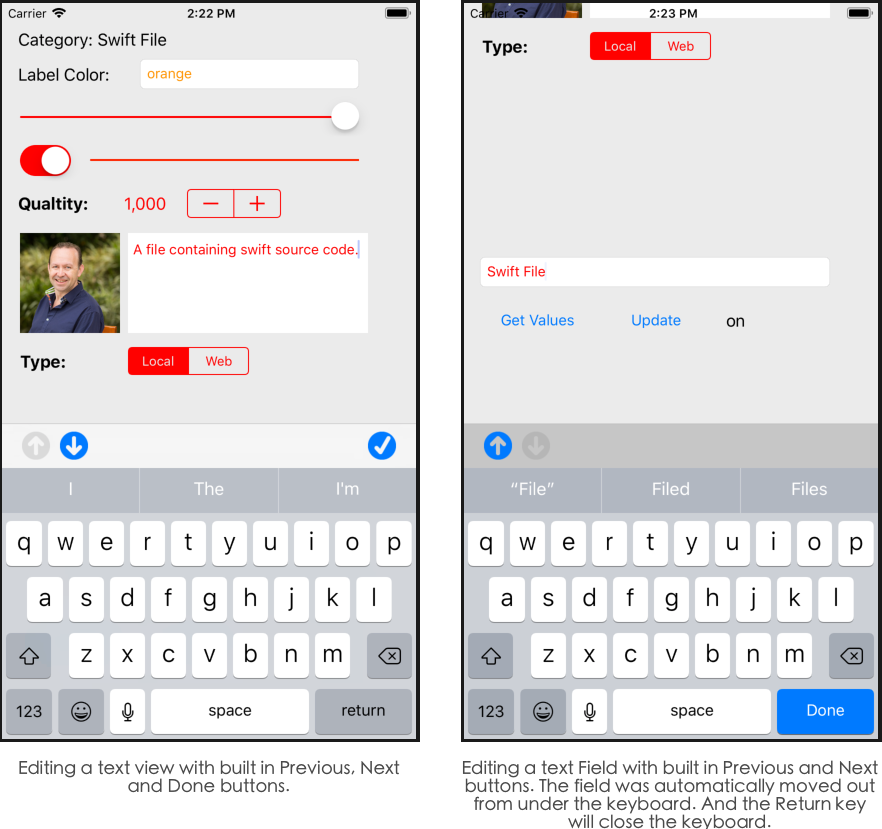
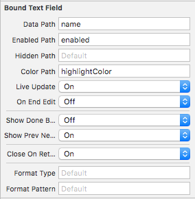
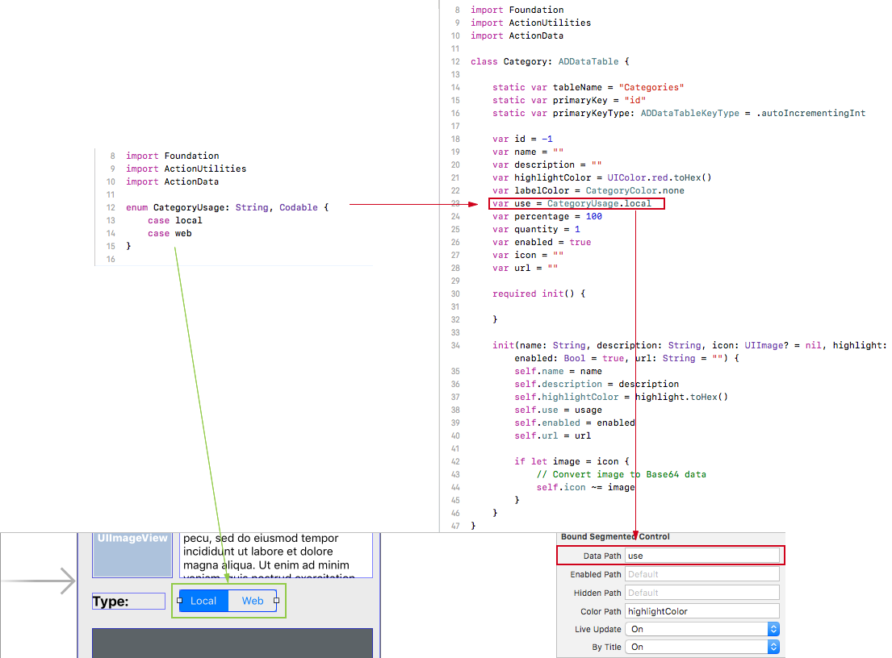
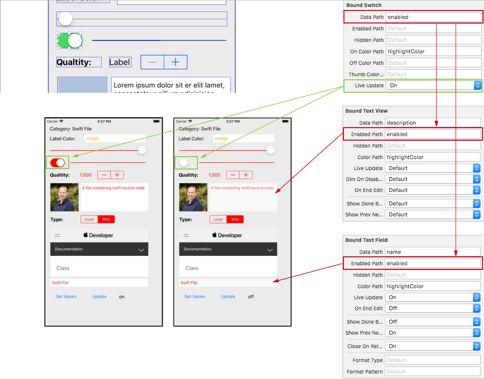
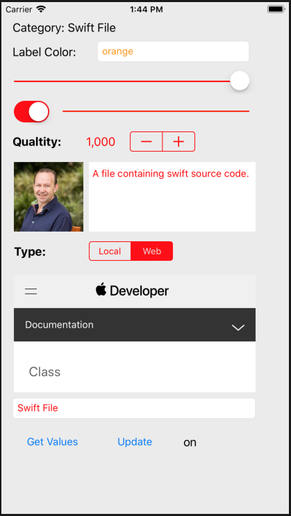

# About Action Data Binding

Our **Action Data Binding** controls allows you to quickly develop and maintain complex iOS forms and data displays by binding fields in your data model (any Swift class or structure that conforms to the `Codeable` protocol) to UI elements in your Storyboard in Interface Builder via designable properties:



Simply match the name of an available **Key Path** property (such as `dataPath`) on a **Bound Control** to the name of a property on your data model and the **Bound View Controller** will automatically handle populating the form with the values from your model and reading user edits back into the model, all without having to create **Outlets** or **Actions** in your Storyboard.

**Action Data Binding** controls provides the following:

* [Path Formulas](#Path-Formulas)
* [Formatting Values](#Formatting-Values)
* [Automatic Keyboard Handling](#Automatic-Keyboard-Handling)
* [Selecting from Multiple Options](#Selecting-from-Multiple-Options)
* [Responding to User Events](#Responding-to-User-Events)
* [Available Bound Controls](#Available-Bound-Controls)

With **Action Data Binding** you can create a complex, interactive forms using Interface builder and very little code in three easy steps:

1. [Define the Data Model](#Define-the-Data-Model)
2. [Design the Form's Storyboard](#Design-the-Forms-Storyboard)
3. [Code the View Controller](#Code-the-View-Controller)

<a name="Path-Formulas"></a>
## Path Formulas

In addition to being simple field names, a **Key Path** can be a formula using a SQL like syntax. For example, this complex formula sets the color of a **Bound Text Picker** when the value changes:



Or this simple formula that sets the title of a **Bound Label**:


<a name="Formatting-Values"></a>
## Formatting Values

Several **Action Data Binding** controls have the ability to format data before it is shown to the user (in one of three formats: **Number**, **Date** or **Masked String**) by setting designable properties in Interface Builder. For example, formatting a number on a **Bound Label**:


<a name="Action-Data-Masked-String-Formatter"></a>
### Action Data Masked String Formatter

A **Masked String Formatter** takes a formatting string and applies it as a mask to a given string value. For example, applying format string `(###) ###-####` to `8085551212` would result in `(808) 555-1212`. A **Masked String Formatter** can also be used to remove a format from a string, using the example above, given `(808) 555-1212` would result in `8085551212`.

<a name="Supported-Format-Characters"></a> 
#### Supported Format Characters
 
* **#** - An optional number (0-9). If a number is available at the current character location, the number is emitted, else a space (` `) will be emitted.
* **0** - A fixed number (0-9). If a number is available at the current character location, the number is emitted, else a zero (`0`) will be emitted.
* **X** - An uppercased letter (A-Z). If a letter is available, it will be converted to upper case and emitted, else a space (` `) is emitted.
* **x** - A lowercased letter (a-z). If a letter is available, it will be converted to lower case and emitted, else a space (` `) is emitted.
* * - Any letter (A-Z or a-z). If a letter is available, it will be emitted, else a space (` `) is emitted.
* **_** - Any character. No matter what the character is, it will be emitted as-is.
* **\\** - Escapes the next character and includes it in the formatted output. Use `\` to include a `\`, `#`, `0`, `X`, `x`, `*` or `_` character in the output.
 
Any other character in the format string will be output as-is in the formatted string.
 
##### Example
 
```swift
// Configure formatter.
let formatter = ADMaskedStringFormatter()
formatter.formatString = "(###) ###-####"
 
// Apply format.
let output = formatter.applyFormat(to: "8085551212")
let valid = formatter.validForLastInput
 
// Strip format.
let result = formatter.removeFormat(from: output)
```

<a name="Automatic-Keyboard-Handling"></a>
## Automatic Keyboard Handling

For bound UI controls that display the onscreen keyboard, the **Bound View Controller** will automatically handle moving controls out from under the keyboard if they are covered by it when it opens and moving them back to their original location afterwards:



Additionally, the keyboard can include **Previous** and **Next** buttons to move between **Bound Text** controls and can include a **Done** button or use the **Return** key to close the keyboard. These are based on designable properties in Interface Builder for each control:



These buttons can be customized using the `prevButtonText`, `prevButtonImage`, `nextButtonText`, `nextButtonImage`, `doneButtonText`, `doneButtonImage`, `cancelButtonText` and `cancelButtonImage` properties of the **Bound View Controller**, which can be customized directly in Interface Builder:


<a name="Selecting-from-Multiple-Options"></a>
## Selecting from Multiple Options

If you need to allow the user to select from a list of available options, you can use **Bound Text Picker**. For example: 


For a very limited number of options, you can use a **Bound Segmented Control**. For example:



Use the `byTitle` property to decide if the segment is selected by title or integer position.

<a name="Responding-to-User-Events"></a>
## Responding to User Events

By setting the **Live Update** property of a **Bound Control** to `true`, the **Bound View Controller** will update the User Interface interactively, as the user makes changes. For example, this **Bound Switch** enabling or disabling editing of a **Bound Text View** and **Bound Text Field** as it changes:



<a name="Available-Bound-Controls"></a>
## Available Bound Controls

**Action Data Binding** provides the following controls that you can use to build your interactive forms and data displays:

### Text Controls

* **Bound Label** - Displays one or more lines of non-editable text.
* **Bound Text Field** - Displays or edits one line of text.
* **Bound Text View** - Displays or edits a block of text.

Use the `dataPath` property to specify the field from the bound data model to populate the label, text field or text view from or supply a formula in a SQL like syntax.

If the value is an `Int` or `Float` it will be converted to a string. If the value is a `Bool` it will be converted to the string values of `true` or `false`. If a `formatType` and `formatPattern` have been specified, they will be applied to the value before it is set.

### Numeric Controls

* **Bound Slider** - Allows the user to pick between a range of numbers by dragging the thumb on a slider.
* **Bound Stepper** - Allows the user to pick between a range of numbers by tapping the + or - button to increment or decrement the value.
* **Bound Progress View** - Displays a number as the percent complete.

Use the `dataPath` property to specify the field from the bound data model to populate the Slider, Stepper or Progress View from or supply a formula in a SQL like syntax. 

If the value is a `String`, it will attempted to be converted to a `Float`.

### Boolean Controls

* **Bound Switch** - Allows the user to pick an on or off state.

Use the `dataPath` property to specify the field from the bound data model to populate the Switch from or supply a formula in a SQL like syntax. 

If the value is an `Int` or `Float` it will be converted to a `Bool` (1 = `true` and 0 = `false`. If the value is a `String` it will be converted to a `Bool` where the string values of "true", "yes" or "1" = `true and the values of "false", "no" or "0" = `false`.

### Option Selection Controls

* **Bound Segmented Control** - Allows the user to select from a very limited number of options.
* **Bound Text Picker** - Allows the user to select from a number of available options.

Use the `dataPath` property to specify the field from the bound data model to select the segment from or use a formula in a SQL like syntax.

For the **Bound Segmented Control**, use the `byTitle` property to decide if the segment is selected by title or integer position.

For the **Bound Text Picker**, the `title` property sets the title displayed over the picker and the `optionValues` property includes a comma separated list of values the user can select from. 

### Image Controls

* **Bound Image View** - Displays an image in the form.

Use the `dataPath` property to specify the field from the bound data model to populate the image view from or a formula in a SQL like syntax.

If the value is `String`, this control assumes its a Base 64 encoded image and will attempt to decode and display it.

### Web Controls

* **Bound Web View** - Displays a URL or raw HTML in the form.

Use the `dataPath` property to specify the field from the bound data model to use as the URL or the HTML data to display in the web view. Use the `containsHTML` property to decide if the `dataPath` contains a `URL` or `HTML` data.

<a name="Available-Bound-Control"></a>
## Quick Example

Let's take a look at a simple example to show how quickly you can create a complex, interactive form with **Action Data Binding** using Interface builder and very little code.

This can be done in three easy steps:

<a name="Define-the-Data-Model"></a>
### 1) Define the Data Model

Define your data model using either a Swift structure or class. As long as the properties and the structure or class itself conform to the `Codable` protocol (or another protocol that conforms to `Codable`), the model can be used for data binding. 

In the following example, we're conforming to `ADDataTable` (which conforms to `Codable`) so the model can be easily written to or read from a SQLite database using a `ADSQLProvider`:

```swift
import Foundation
import ActionUtilities
import ActionData

enum CategoryUsage: String, Codable {
    case local
    case web
}

enum CategoryColor: String, Codable {
    case none
    case red
    case orange
    case yellow
    case green
    case blue
    case indigo
    case violet
}

class Category: ADDataTable {
    
    static var tableName = "Categories"
    static var primaryKey = "id"
    static var primaryKeyType: ADDataTableKeyType = .autoIncrementingInt
    
    var id = -1
    var name = ""
    var description = ""
    var highlightColor = UIColor.red.toHex()
    var labelColor = CategoryColor.none
    var use = CategoryUsage.local
    var percentage = 100
    var quantity = 1
    var enabled = true
    var icon = ""
    var url = ""
    
    required init() {
        
    }
    
    init(name: String, description: String, icon: UIImage? = nil, highlight: UIColor = UIColor.white, usage: CategoryUsage = .local, enabled: Bool = true, url: String = "") {
        self.name = name
        self.description = description
        self.highlightColor = highlight.toHex()
        self.use = usage
        self.enabled = enabled
        self.url = url
        
        if let image = icon {
            // Convert image to Base64 data
            self.icon ~= image
        }
    }
}
```

<a name="Design-the-Forms-Storyboard"></a>
### 2) Design the Form's Storyboard

In Interface Builder, add multiple **Bound Controls** and set their `dataPath` and any other required values to make the form interactive:


<a name="Code-the-View-Controller"></a>
### 3) Code the View Controller

The following code is all that is required to populate the form and read the value back when the user edits the form:

```swift
import UIKit
import ActionData
import ActionUtilities

class ViewController: ADBoundViewController {

    @IBAction func getValues(_ sender: Any) {
        do {
        	// Read the values back from the form.
            let category = try getDataModel(Category.self)
            print("Category: \(category.description)")
        } catch {
            print("Unable to read data model")
        }
    }
    
    @IBAction func UpdateForm(_ sender: Any) {
        
        // Force a screen update.
        refreshDisplay()
    }
    
    override func viewDidLoad() {
        super.viewDidLoad()
        // Do any additional setup after loading the view, typically from a nib.
    }
    
    override func viewWillAppear(_ animated: Bool) {
        super.viewWillAppear(animated)
        
        // Create and populate a category.
        let category = Category(name: "Swift File", description: "A file containing swift source code.", icon: #imageLiteral(resourceName: "Person"), usage: .local, url: "https://developer.apple.com/documentation/webkit/wkwebview")
        category.labelColor = .orange
        category.quantity = 1000
        category.highlightColor ~= UIColor.red
        
        // Bind the category to the form.
        do {
            try setDataModel(category)
        } catch {
            print("Failed to set data model")
        }
    }

}
```

When the app is run, the form will automatically be populated and will respond to edit events:




