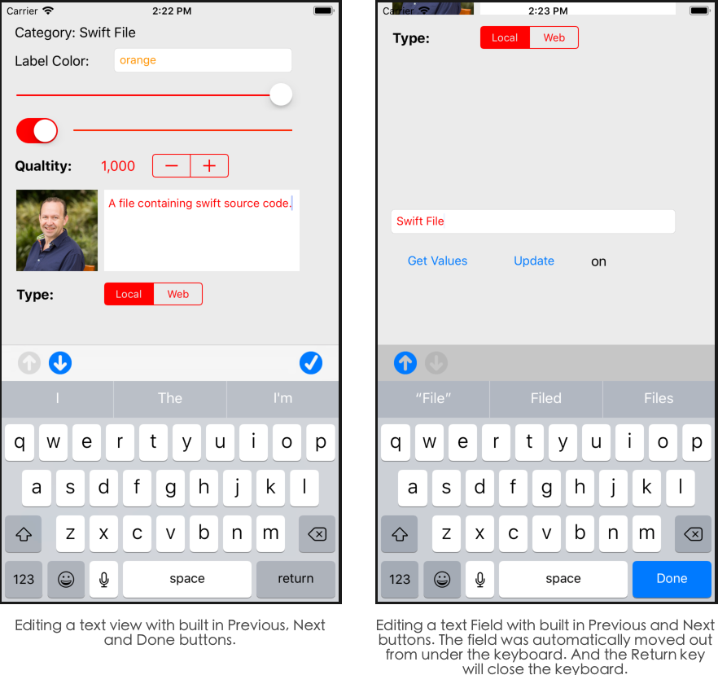

# Action Data Binding Quick Start

Our **Action Data Binding** controls allows you to quickly develop and maintain complex iOS forms and data displays by binding fields in your data model (any Swift class or structure that conforms to the `Codeable` protocol) to UI elements in your Storyboard in Interface Builder via designable properties.

The following topics provide a quick overview of the **Data Binding** process:

* [Installing and Adding to an App Project](#Installing-and-Adding-to-an-App-Project)
* [Creating Your Data Model](#Creating-Your-Data-Model)
* [Creating Your User Interface](#Creating-Your-User-Interface)
* [Populating the UI from the Model](#Populating-the-UI-from-the-Model)
* [Responding to User Events](#Responding-to-User-Events)
* [Automatic Keyboard Handling](#Automatic-Keyboard-Handling)
* [Selecting from Multiple Options](#Selecting-from-Multiple-Options)
* [Retrieving User Edits](#Retrieving-User-Edits)

The following topics provide a detailed look into the **Data Binding** process:

* [Key Paths](#Key-Paths)
* [Path Formulas](#Path-Formulas)
	* [Working with Strings](#Working-with-Strings) 
	* [Working with Numbers](#Working-with-Numbers)
	* [Working with Boolean Values](#Working-with-Boolean-Values)
	* [Working with Functions](#Working-with-Functions)
* [Formatting Values](#Formatting-Values)
	* [Number Formatter](#Number-Formatter)
	* [Date Formatter](#Date-Formatter)
	* [Action Data Masked String Formatter](#Action-Data-Masked-String-Formatter)

The following topics provide a detailed look at each **Bound Control**:

* [ADBoundViewController](#ADBoundViewController) - Manages the binding process.
* [ADBoundLabel](#ADBoundLabel) - Displays a short amount of text.
* [ADBoundTextField](#ADBoundTextField) - Edits a short amount of text.
* [ADBoundTextView](#ADBoundTextView) - Edits a block of text.
* [ADBoundSlider](#ADBoundSlider) - Displays a slider for the user to pick a number from a minimum and maximum value.
* [ADBoundSwitch](#ADBoundSwitch) - Edits an on/off state.
* [ADBoundProgressView](#ADBoundProgressView) - Displays a percent complete for a number inside of a range of numbers.
* [ADBoundStepper](#ADBoundStepper) - Edits a value by incrementing or decrementing it by a given amount.
* [ADBoundImageView](#ADBoundImageView) - Displays an image.
* [ADBoundWebView](#ADBoundWebView) - Displays a URL or raw HTML code.
* [ADBoundSegmentedControl](#ADBoundSegmentedControl) - Allows the user to select from a very limited set of options.
* [ADBoundTextPicker](#ADBoundTextPicker) - Allows the user to select from a set of options.

<a name="Installing-and-Adding-to-an-App-Project"></a>
## Installing and Adding to an App Project

Our [Installing Action Data](http://appracatappra.com/developers/action-data-developer/appracatappra.com/developers/action-data-developer/installing-action-data/) guide will walk you through the steps required to install **Action Data** and **Action Utilities** on your development computer and how to add them to an app project.

<a name="Creating-Your-Data-Model"></a>
## Creating Your Data Model

Define your data model using either a Swift structure or class. As long as the properties and the structure or class itself conform to the `Codable` protocol (or another protocol that conforms to `Codable`), the model can be used for data binding.

In the following example, we're conforming to `ADDataTable` (which conforms to `Codable`) so the model can be easily written to or read from a SQLite database using a `ADSQLProvider`:

```swift
import Foundation
import ActionUtilities
import ActionData

enum CategoryUsage: String, Codable {
    case local
    case web
}

enum CategoryColor: String, Codable {
    case none
    case red
    case orange
    case yellow
    case green
    case blue
    case indigo
    case violet
}

class Category: ADDataTable {
    
    static var tableName = "Categories"
    static var primaryKey = "id"
    static var primaryKeyType: ADDataTableKeyType = .autoIncrementingInt
    
    var id = -1
    var name = ""
    var description = ""
    var highlightColor = UIColor.red.toHex()
    var labelColor = CategoryColor.none
    var use = CategoryUsage.local
    var percentage = 100
    var quantity = 1
    var enabled = true
    var icon = ""
    var url = ""
    
    required init() {
        
    }
    
    init(name: String, description: String, icon: UIImage? = nil, highlight: UIColor = UIColor.white, usage: CategoryUsage = .local, enabled: Bool = true, url: String = "") {
        self.name = name
        self.description = description
        self.highlightColor = highlight.toHex()
        self.use = usage
        self.enabled = enabled
        self.url = url
        
        if let image = icon {
            // Convert image to Base64 data
            self.icon ~= image
        }
    }
}
```

In the above class, we are using features of **Action Utilities** to store an image as a Base 64 encoded string and colors as a string in the form `#RRGGBB` so that the class can be `Codable` (since neither `UIImage` or `UIColor` conform to `Codable`).

The **Action Data Binding** controls can accept and work with images and colors in these formats automatically. Additionally, **Action Data Binding** controls handle enums that are backed by `String` or `Integer` values such as the `CategoryUsage` and `CategoryColor` enums above.

<a name="Creating-Your-User-Interface"></a>
## Creating Your User Interface

You'll add a `ADBoundViewController` and one or more controls conforming to the `ADBindable` protocol to your UI design to view and/or modify data in your model. 

To get started, select the `ViewController.Swift` file from the **Project Navigator**, import the `ActionData` and `ActionUtilities` libraries and change to the `ViewController` to inherit from `ADBoundViewController`:


Switch to **Interface Builder** and drag in a control such as a `UILabel`, switch to the **Identity Inspector** and change the **Class** to `ADBoundLabel`:


Return to the **Attribute Inspector** and set the **Binding Properties** required to configure the control and bind it to a field in the data model:


At a bare minimum, you will need to define the **Data Path** (where to get the data from as defined as a **Key Path**) that will either be the name of a field in our data model or a formula in the syntax similar to a SQL `where` or `select` clause.

Depending on the control, other paths exist to show or hide the control, enable or disable it, format the value displayed or update the UI based on the data entered. Set these values as needed and repeat these steps to add more bound controls and fill out the required User Interface.

<a name="Populating-the-UI-from-the-Model"></a>
## Populating the UI from the Model

Once your UI is complete in Interface Builder, switch to the `ViewController.swift` file and use the `setDataModel` function of the `ADBoundViewController` to populate the view from the values in the model. For example:

```swift
import ActionData
import ActionUtilities
...

// Create a model instance and populate it
let category = Category(name: "Swift File", description: "A file containing swift source code.", icon: #imageLiteral(resourceName: "Person"), usage: .local, url: "https://developer.apple.com/documentation/webkit/wkwebview")
category.labelColor = .orange
category.quantity = 1000
category.highlightColor ~= UIColor.red

// Bind the model to the 
do {
    try setDataModel(category)
} catch {
    print("Failed to set data model")
}
```

The `ADBoundViewController` will automatically find every **Bound Control** in the **View** and **Subviews** it controls and will populate the values based on the **Key Paths** you configured in Interface Builder.

<a name="Responding-to-User-Events"></a>
## Responding to User Events

By setting the **Live Update** property of a **Bound Control** to `true`, the **Bound View Controller** will update the User Interface interactively, as the user makes changes. For example, this **Bound Switch** enabling or disabling editing of a **Bound Text View** and **Bound Text Field** as it changes:


<a name="Automatic-Keyboard-Handling"></a>
## Automatic Keyboard Handling

For bound UI controls that display the onscreen keyboard, the **Bound View Controller** will automatically handle moving controls out from under the keyboard if they are covered by it when it opens and moving them back to their original location afterwards:



Additionally, the keyboard can include **Previous** and **Next** buttons to move between **Bound Text** controls and can include a **Done** button or use the **Return** key to close the keyboard. These are based on designable properties in Interface Builder for each control:


These buttons can be customized using the `prevButtonText`, `prevButtonImage`, `nextButtonText`, `nextButtonImage`, `doneButtonText`, `doneButtonImage`, `cancelButtonText` and `cancelButtonImage` properties of the **Bound View Controller**, which can be customized directly in Interface Builder:


Specify either the text for the button a given Accessory View button or select an image (added to the app's `Assets.xcassets`) to display as an icon on the button (as seen in the screenshots above).

<a name="Selecting-from-Multiple-Options"></a>
## Selecting from Multiple Options

If you need to allow the user to select from a list of available options, you can use **Bound Text Picker**. For example: 


For a very limited number of options, you can use a **Bound Segmented Control**. For example:


Use the `byTitle` property to decide if the segment is selected by title or integer position.

<a name="Retrieving-User-Edits"></a>
## Retrieving User Edits

After the user is finished editing a the bound UI, use the `getDataModel` function of the `ADBoundViewController` to retrieve the updated values and write them back to the data model based on the provided **Key Paths**. For example:

```swift
import ActionData
import ActionUtilities
...

// Retrieve changes to the data
do {
    let category = try getDataModel(Category.self)
    print("Category: \(category.description)")
} catch {
    print("Unable to read data model")
}
```

# Action Data Binding Details

The following sections provide a deep look into the **Data Binding** process including **Key Paths** and formulas, automatically formatting values and the available **Data Bound Controls**.

<a name="Key-Paths"></a>
## Key Paths

A **Key Path** is used to bind a UI control (conforming to the `ADBindable` protocol) to a value in your data model, such as the example below from a **Bound Slider**:


**Note**: A **Key Path** is case sensitive and must match the name and case of a data model field exactly to be automatically bound successfully.

Depending on the type of bound control, one or more **Key Paths** can be used to provide the data the control displays or edits and to configure properties of the control, such as this **Bound Slider**:


That has paths to enable or disable the control, hide or show it, and set the color of the minimal value, maximum value and the thumb. The type of value that a given path returns should match the type of path being set. So given the example above:

* **Data Path** - Can either be a `Int`, `Float` or a `String` value. If a `String` is given, the control will attempt to convert it to a valid `Float` value.
* **Enabled Path**, **Hidden Path** - Can either be a `Bool`, `Int`, `Float` or a `String` value. If the value is an `Int` or `Float`, `0` and `1` will be converted to `false` and `true`. If the value is a `String`, "yes", "on", "true" or "1" will be converted to `true`, all other values will result in `false`.
* **Min Color Path**, **Max Color Path**, **Thumb Color Path** - Expect a `String` value in the form `RRGGBB`, `RRGGBBAA`, `#RRGGBB`, `#RRGGBBAA` where: 
	* `RR` is a hex value for the red channel.
	* `GG` is a hex value for the green channel.
	* `BB` is a hex value for the blue channel.
	* `AA` is a hex value for the alpha (or transparency) channel.

Again, the required data return by a **Key Path** will be dependent on the type of **Bound Control**. Take the example of a **Bound Text View**:


Where the **Data Path** should be a `String` value. If the value is an `Int` or `Float` it will be converted to its string representation. If the value is a `Bool` it will be converted to the string values of `true` or `false`.

Or a **Bound Image View**:


Where the **Data Path** should be a `String` value containing a Base 64 encoded image.

<a name="Path-Formulas"></a>
## Path Formulas

In addition to simply being the name of a field from your data model, a **Key Path** can be a formula in a SQL like syntax, such as this simple formula to set the title of a **Bound Label**:


Or this complex formula to set the color of a **Bound Text Picker** when the value changes:


Just like a regular **Key Path**, a **Path Formula** should return the appropriate type of data for a given path, such as the `String` value of the **Bound Label's Data Path** or a `String` in the form `#RRGGBB` for the **Bound Text Picker's Color Path** above.

When you include the name of a field from your data model in a formula, its value will be read during data binding, converted to the correct type required by the formula and used in evaluating the formula. 

For controls that edit data (such as a **Bound Text Field**), you should not set the **Data Path** using a formula because the `ADBoundViewController` will not be able to read user edits back into the data model.

<a name="Working-with-Strings"></a>
### Working with Strings

String values may contain constants enclosed in single quotes, such as `'Hello World'`. Additionally, string values can be combined using the `+` such as `'Hello' + ' ' + 'World'`. String values can be compared using `=`, `!=`, `<`, `>`, `<=` or `>=`.

The SQL `LIKE` statement can be used to test if a string matches a pattern. Such as `'Hello' LIKE '%lo'` to see if a if a string ends in `lo` or `'Hello' LIKE 'H%'` to see if a string starts with 'H'. The `LIKE` pattern can contain one of the following wildcard characters:

* % - The percent sign represents zero, one, or multiple characters.
* _ - The underscore represents a single character.

Use the SQL `REGEX` statement to test a string against a regular expression. For example: `myField REGEXP '\b3\b'`.

Use the SQL `IN` statement to test if the string is one of a possible set of values. For example: `myField IN('one', 'two', 'three')`.

Use the SQL `CASE` statement to take action based on a given value. For example:

```sql
CASE myField
WHEN 'one' THEN 1
WHEN 'two' THEN 2
WHEN 'three' THEN 3
ELSE 0
END
```

<a name="Working-with-Numbers"></a>
### Working with Numbers

Numeric values can be computed using `+`, `-`, `*`, `/` and formulas can use parentheses to control the evaluation order. For example: `(myField + 10) / 100`. Numeric values can be compared using `=`, `!=`, `<`, `>`, `<=` or `>=`.

Use the SQL `BETWEEN` statement to test if a number is between two values. For example: `myField BETWEEN 0 AND 100`.

Use the SQL `IN` statement to test if the number is one of a possible set of values. For example: `myField IN(1, 2, 3)`.

Use the SQL `CASE` statement to take action based on a given value. For example:

```sql
CASE myField
WHEN 1 THEN 'one'
WHEN 2 THEN 'two'
WHEN 3 THEN 'three'
ELSE 'zero'
END
```

<a name="Working-with-Boolean-Values"></a>
### Working with Boolean Values

Use `AND`, `OR` and `NOT` to evaluate boolean values. For example: `myField > 0 AND myField < 100`. Additionally, use parentheses to control the evaluation order. For example: `(myField > 0 AND myField < 100) OR myField = 1000`.

<a name="Working-with-Functions"></a>
### Working with Functions

Several functions are available and can be used in your **Path Formulas** such as:

* **ltrim(value)** - Trims any white space characters off of the left side of the given string value.
* **trim(value)** - Trims any white space characters from both the left and right side of the given string value.
* **rtrim(value)** - Trims any white space characters off of the right side of the given string value.
* **instr(value, pattern)** - Returns `true` if the given string contains the given pattern. For example: `instr(myField, 'hello')`.
* **replace(value, pattern, replacement)** - Replaces all occurrences of the `pattern` with the `replacement` value. For example: `replace(myField, 'hello', 'hi')`.
* **substr(value, position, length)** - Returns a section of the given string starting at character `position` for `length` characters. For example: `substr(myField, 4, 2)`.
* **upper(value)** - Returns the string converted to uppercase.
* **lower(value)** - Returns the string converted to lowercase.
* **length(value)** - Returns the number of characters in the given string.
* **abs(value)** - Returns the absolute value of the given number. 
* **random()** - Returns a random number between 0 and 64,000,000.
* **random(value)** - Returns a random number between 0 and `value`.
* **random(low, high)** - Returns a random number between `low` and `high`.
* **compare(test, equals, notequal)** - Based on the value of `test`, returns either `equals` or `notequal`. For example: `compare(myField > 10, 'quantity good', 'order more product')`


<a name="Formatting-Values"></a>
## Formatting Values

Several **Action Data Binding** controls have the ability to format data before it is shown to the user (in one of three formats: **Number**, **Date** or **Masked**) by setting designable properties in Interface Builder. For example, formatting a number on a **Bound Label**:


<a name="Number-Formatter"></a>
### Number Formatter

Allows you to convert numeric values to their textual representations. For example: `###,###` would output the value `1000` as `1,000`. The **Bound Label** and **Bound Text Field** expose the formatter via the `numberFormatter` property if you need to configure more options. See Apples [NumberFormatter](https://developer.apple.com/documentation/foundation/numberformatter) documentation for more details.

<a name="Date-Formatter"></a>
### Date Formatter

Allows you to convert date and time values to their textual representations. For example: `mm/dd/yyyy` would output a date as `01/01/2018`. The **Bound Label** and **Bound Text Field** expose the formatter via the `dateFormatter` property if you need to configure more options. See Apples [DateFormatter](https://developer.apple.com/documentation/foundation/dateformatter) documentation for more details.

<a name="Action-Data-Masked-String-Formatter"></a>
### Action Data Masked String Formatter

A **Masked String Formatter** takes a formatting string and applies it as a mask to a given string value. For example, applying format string `(###) ###-####` to `8085551212` would result in `(808) 555-1212`. A **Masked String Formatter** can also be used to remove a format from a string, using the example above, given `(808) 555-1212` would result in `8085551212`.

<a name="Supported-Format-Characters"></a> 
#### Supported Format Characters
 
* **#** - An optional number (0-9). If a number is available at the current character location, the number is emitted, else a space (` `) will be emitted.
* **0** - A fixed number (0-9). If a number is available at the current character location, the number is emitted, else a zero (`0`) will be emitted.
* **X** - An uppercased letter (A-Z). If a letter is available, it will be converted to upper case and emitted, else a space (` `) is emitted.
* **x** - A lowercased letter (a-z). If a letter is available, it will be converted to lower case and emitted, else a space (` `) is emitted.
* * - Any letter (A-Z or a-z). If a letter is available, it will be emitted, else a space (` `) is emitted.
* **_** - Any character. No matter what the character is, it will be emitted as-is.
* **\\** - Escapes the next character and includes it in the formatted output. Use `\` to include a `\`, `#`, `0`, `X`, `x`, `*` or `_` character in the output.
 
Any other character in the format string will be output as-is in the formatted string.
 
##### Example
 
```swift
// Configure formatter.
let formatter = ADMaskedStringFormatter()
formatter.formatString = "(###) ###-####"
 
// Apply format.
let output = formatter.applyFormat(to: "8085551212")
let valid = formatter.validForLastInput
 
// Strip format.
let result = formatter.removeFormat(from: output)
```

# Data Bound Controls

This section will take a detailed look at the **Bound View Controller** and each of the **Data Bound Controls** provided.

<a name="ADBoundViewController"></a>
## ADBoundViewController

A `ADBoundViewController` provides a method to attach it to a data model (any Swift class or structure that conforms to the `Codable` protocol) and any control conforming to the `ADBindable` protocol on any **View** or **SubView** will automatically be populated with the values from the data model based on the `dataPath` property of the control.

By using the `setDataModel` function to set the model and automatically populate the fields, you to not need to create **Actions** or **Outlets** for the individual controls. The `ADBoundViewController` will automatically handle the reading and writing of properties for you.

For any `ADBindable` control that is editable, calling the `getDataModel` function will return the values from the controls on the **View** and **SubViews**. These will be written to the field of the data model as specified by the `dataPath` property of the control, as a result, a formula should not be used for the `dataPath` of any field that is readable.

For any field that requires onscreen keyboard support, the `ADBoundViewController` will automatically handle keyboard events such as moving fields hidden by the keyboard so they are visible and moving them back after they lose focus. Accessory tools can be automatically added to the keyboard to move between the text entry fields and to close the keyboard based on options for each control. These buttons can be customized using the `prevButtonText`, `prevButtonImage`, `nextButtonText`, `nextButtonImage`, `doneButtonText` and `doneButtonImage` properties of the `ADBoundViewController`.

The `ADBoundTextPicker` control has an embedded picker view that will be handled automatically by the `ADBoundViewController` in a similar fashion as the onscreen keyboard. If the field is covered by the picker, it will be moved automatically to be shown and moved back when the picker is closed. An accessory toolbar will be added to the picker that can be customized with the `cancelButtonText`, `cancelButtonImage`, `doneButtonText` and `doneButtonImage` properties of the `ADBoundViewController`.

The `prevButtonText`, `prevButtonImage`, `nextButtonText`, `nextButtonImage`, `doneButtonText`, `doneButtonImage`, `cancelButtonText` and `cancelButtonImage` properties can be customized directly in Interface Builder:


### Properties

* **record** - A `ADRecord` that holds the value from the data model while the form is being displayed or edited as key/value pairs. The `setDataModel` function populates this dictionary and the `getDataModel` function reads the results back. Between those calls you can manipulate the values directly in the `record` dictionary if required.
* **prevButtonText** - Defines the text of the previous button that can be displayed in the onscreen keyboard accessory view. 
* **prevButtonImage** - Defines the image for the previous button that can be displayed in the onscreen keyboard accessory view.
* **nextButtonText** - Defines the text of the next button that can be displayed in the onscreen keyboard accessory view.
* **nextButtonImage** - Defines the image for the next button that can be displayed in the onscreen keyboard accessory view.
* **doneButtonText** - Defines the text of the done button that can be displayed in the onscreen keyboard and picker view accessory view.
* **doneButtonImage** - Defines the image for the done button that can be displayed in the onscreen keyboard and picker view accessory view.
* **cancelButtonText** - Defines the text of the cancel button that can be displayed in the onscreen keyboard and picker view accessory view.
* **cancelButtonImage** - Defines the image for the done button that can be displayed in the onscreen keyboard and picker view accessory view.

### Functions

* **setDataModel(model)** - Attaches the given data model (any Swift class or structure conforming to the `Codable` protocol) to the `ADBoundViewController` populating the `record` property and any control conforming to the `ADBindable` protocol on any View or SubView.
* **getDataModel(Model.self)** - Reads the values from any editable control conforming to the `ADBindable` protocol into the given data model (any Swift class or structure conforming to the `Codable` protocol).
* **updateBindings()** - Forces the `ADBoundViewController` to update the values of any control conforming to the `ADBindable` protocol on any **View** or **SubView** controlled by this `ADBoundViewController` with the values from the `record` property.
* **updateRecord()** - Forces the `ADBoundViewController` to update the `record` property with the values from any editable control conforming to the `ADBindable` protocol on any View or SubView controlled by this `ADBoundViewController`.
* **refreshDisplay()** - Forces the `ADBoundViewController` to read the values from any bound control in the `controls` array into the `record` property and write the values back to the bound controls to refresh the view.

<a name="ADBoundLabel"></a>
## ADBoundLabel

Creates a label that can be bound to a value from a data model that conforms to the `Codable` protocol when placed on a `ADBoundViewController` view. Use the `dataPath` property to specify the field from the bound data model to populate the label from or supply a formula in a SQL like syntax.


### Properties

* **dataPath** - The name of the field from the date model or formula (using SQL syntax) used to populate the text of the label from.
* **enabledPath** - The name of the field from the date model or formula (using SQL syntax) used to set the hidden state from.
* **hiddenPath** - The name of the field from the date model or formula (using SQL syntax) used to set the hidden state from.
* **colorPath** - The name of the field from the date model or formula (using SQL syntax) used to set the text color from.
* **formatType** - Defines the type of formatter that will be used to format the value of this text field before it is displayed to the user. The currently supported formats are "number", "masked" or "date".
* **formatPattern** - Works with the `formatType` property to format the value that is displayed to the user based on the pattern given in this string. For example, `$###,###.00` for a number or `mm/dd/yyyy` for a date.
* **numberFormatter** - Built-in number formatter used with the `formatType` of `number` and `formatPattern` properties to automatically format numeric values.
* **dateFormatter** - Built-in date formatter used with the `formatType` of `date` and `formatPattern` properties to automatically format date/time values.
* **maskedFormatter** - Built-in masked string formatter used with the `formatType` of `masked` and `formatPattern` properties to automatically format string values.

<a name="ADBoundTextField"></a>
## ADBoundTextField

Creates a text field that can be bound to a value from a data model that conforms to the `Codable` protocol when placed on a `ADBoundViewController` view. Use the `dataPath` property to specify the field from the bound data model to populate the text field from or use a formula in a SQL like syntax.


### Properties

* **dataPath** - The name of the field from the date model or formula (using SQL syntax) used to populate the text of the field from.
* **enabledPath** - The name of the field from the date model or formula (using SQL syntax) used to set the hidden state from.
* **hiddenPath** - The name of the field from the date model or formula (using SQL syntax) used to set the hidden state from.
* **colorPath** - The name of the field from the date model or formula (using SQL syntax) used to set the text color from.
* **liveUpdate** - If `true` this text view cause the parent `ADBoundViewController` to update the form when the value changes. Works with the `onEndEdit` property, if it's `true` the change will only be sent when the user finishes editing the field, else the change will be sent on individual character changes.
* **onEndEditing** - Works with the `liveUpdate` property, if it's `true` the change will only be sent when the user finishes editing the field, else the change will be sent on individual character changes.
* **showDoneButton** - If `true` a **Done** accessory button will be displayed along with the onscreen keyboard when this field is edited.
* **showPrevNextButtons** - If `true` **Previous** and **Next** accessory buttons will be displayed along with the onscreen keyboard when this field is edited.
* **closeOnReturn** - If `true` this `ADBoundTextField` will resign first responder and close the onscreen keyboard when the **Return** key is tapped.
* **formatType** - Defines the type of formatter that will be used to format the value of this text field before it is displayed to the user. The currently supported formats are "number", "masked" or "date".
* **formatPattern** - Works with the `formatType` property to format the value that is displayed to the user based on the pattern given in this string. For example, `$###,###.00` for a number or `mm/dd/yyyy` for a date.
* **numberFormatter** - Built-in number formatter used with the `formatType` of `number` and `formatPattern` properties to automatically format numeric values.
* **dateFormatter** - Built-in date formatter used with the `formatType` of `date` and `formatPattern` properties to automatically format date/time values.
* **maskedFormatter** - Built-in masked string formatter used with the `formatType` of `masked` and `formatPattern` properties to automatically format string values.

<a name="ADBoundTextView"></a>
## ADBoundTextView

Creates a text view that can be bound to a value from a data model that conforms to the `Codable` protocol when placed on a `ADBoundViewController` view. Use the `dataPath` property to specify the field from the bound data model to populate the text view from or a formula in a SQL like syntax.


### Properties

* **dataPath** - The name of the field from the date model or formula (using SQL syntax) used to populate the text of the field from.
* **enabledPath** - The name of the field from the date model or formula (using SQL syntax) used to set the hidden state from.
* **hiddenPath** - The name of the field from the date model or formula (using SQL syntax) used to set the hidden state from.
* **colorPath** - The name of the field from the date model or formula (using SQL syntax) used to set the text color from.
* **liveUpdate** - If `true` this text view cause the parent `ADBoundViewController` to update the form when the value changes. Works with the `onEndEdit` property, if it's `true` the change will only be sent when the user finishes editing the field, else the change will be sent on individual character changes.
* **onEndEditing** - Works with the `liveUpdate` property, if it's `true` the change will only be sent when the user finishes editing the field, else the change will be sent on individual character changes.
* **showDoneButton** - If `true` a **Done** accessory button will be displayed along with the onscreen keyboard when this field is edited.
* **showPrevNextButtons** - If `true` **Previous** and **Next** accessory buttons will be displayed along with the onscreen keyboard when this field is edited.
* **closeOnReturn** - If `true` this `ADBoundTextField` will resign first responder and close the onscreen keyboard when the **Return** key is tapped.

<a name="ADBoundSlider"></a>
## ADBoundSlider

Creates a slider that can be bound to a value from a data model that conforms to the `Codable` protocol when placed on a `ADBoundViewController` view. Use the `dataPath` property to specify the field from the bound data model to populate the slider's value from or use a formula in a SQL like syntax.


### Properties

* **dataPath** - The name of the field from the date model or formula (using SQL syntax) used to populate the current value of the slider from.
* **enabledPath** - The name of the field from the date model or formula (using SQL syntax) used to set the hidden state from.
* **hiddenPath** - The name of the field from the date model or formula (using SQL syntax) used to set the hidden state from.
* **minColorPath** - The name of the field from the date model or formula (using SQL syntax) used to set the minimum track tint color from.
* **maxColorPath** - The name of the field from the date model or formula (using SQL syntax) used to set the maximum track tint color from.
* **thumbColorPath** - The name of the field from the date model or formula (using SQL syntax) used to set the thumb tint color from.
* **liveUpdate** - If `true` this slider cause the parent `ADBoundViewController` to update the form as the value of the slider changes.

<a name="ADBoundSwitch"></a>
## ADBoundSwitch

Creates a switch that can be bound to a value from a data model that conforms to the `Codable` protocol when placed on a `ADBoundViewController` view. Use the `dataPath` property to specify the field from the bound data model to populate the switch from or a formula in a SQL like syntax.


### Properties

* **dataPath** - The name of the field from the date model or formula (using SQL syntax) used to populate the current value of the switch from.
* **enabledPath** - The name of the field from the date model or formula (using SQL syntax) used to set the hidden state from.
* **hiddenPath** - The name of the field from the date model or formula (using SQL syntax) used to set the hidden state from.
* **onColorPath** - The name of the field from the date model or formula (using SQL syntax) used to set the on tint color from.
* **offColorPath** - The name of the field from the date model or formula (using SQL syntax) used to set the off tint color from.
* **thumbColorPath** - The name of the field from the date model or formula (using SQL syntax) used to set the thumb tint color from.
* **liveUpdate** - If `true` this switch cause the parent `ADBoundViewController` to update the form as the value changes.

<a name="ADBoundProgressView"></a>
## ADBoundProgressView

Creates a progress view that can be bound to a value from a data model that conforms to the `Codable` protocol when placed on a `ADBoundViewController` view. Use the `dataPath` property to specify the field from the bound data model to populate the progress from or a formula in a SQL like syntax.


### Properties

* **dataPath** - The name of the field from the date model or formula (using SQL syntax) used to populate the current value of the progress view from.
* **enabledPath** - The name of the field from the date model or formula (using SQL syntax) used to set the hidden state from.
* **hiddenPath** - The name of the field from the date model or formula (using SQL syntax) used to set the hidden state from.
* **progressColorPath** - The name of the field from the date model or formula (using SQL syntax) used to set the progress tint color from.
* **trackColorPath** - The name of the field from the date model or formula (using SQL syntax) used to set the track tint color from.
* **minValue** - Sets the minimum value for the progress view.
* **maxValue** - Sets the maximum value for the progress view.

<a name="ADBoundStepper"></a>
## ADBoundStepper

Creates a stepper that can be bound to a value from a data model that conforms to the `Codable` protocol when placed on a `ADBoundViewController` view. Use the `dataPath` property to specify the field from the bound data model to populate the stepper's value from or a formula in a SQL like syntax.


### Properties

* **dataPath** - The name of the field from the date model or formula (using SQL syntax) used to populate the current value of the stepper view from.
* **enabledPath** - The name of the field from the date model or formula (using SQL syntax) used to set the hidden state from.
* **hiddenPath** - The name of the field from the date model or formula (using SQL syntax) used to set the hidden state from.
* **colorPath** - The name of the field from the date model or formula (using SQL syntax) used to set the tint color from.
* **liveUpdate** - If `true` this stepper cause the parent `ADBoundViewController` to update the form as the value changes.

<a name="ADBoundImageView"></a>
## ADBoundImageView

Creates an image view that can be bound to a value from a data model that conforms to the `Codable` protocol when placed on a `ADBoundViewController` view. Use the `dataPath` property to specify the field from the bound data model to populate the image view from or a formula in a SQL like syntax.


### Properties

* **dataPath** - The name of the field from the date model or formula (using SQL syntax) used to populate the image from.
* **enabledPath** - The name of the field from the date model or formula (using SQL syntax) used to set the hidden state from.
* **hiddenPath** - The name of the field from the date model or formula (using SQL syntax) used to set the hidden state from.
* **colorPath** - The name of the field from the date model or formula (using SQL syntax) used to set the tint color from.

<a name="ADBoundWebView"></a>
## ADBoundWebView

Creates a web view that can be bound to a value from a data model that conforms to the `Codable` protocol when placed on a `ADBoundViewController` view. Use the `dataPath` property to specify the field from the bound data model to use as the URL or the HTML data to display in the web view. Use the `containsHTML` property to decide if the `dataPath` contains a `URL` or `HTML` data.


### Properties

* **dataPath** - The name of the field from the date model or formula (using SQL syntax) used to populate the web view from as either a URL or raw HTML.
* **enabledPath** - The name of the field from the date model or formula (using SQL syntax) used to set the hidden state from.
* **hiddenPath** - The name of the field from the date model or formula (using SQL syntax) used to set the hidden state from.
* **containsHTLM** - If `true` the `dataPath` property contains raw HTML that needs to be displayed, if `false` the `dataPath` contains a URL to display.

<a name="ADBoundSegmentedControl"></a>
## ADBoundSegmentedControl

Creates a segmented control that can be bound to a value from a data model that conforms to the `Codable` protocol when placed on a `ADBoundViewController` view. Use the `dataPath` property to specify the field from the bound data model to select the segment from or use a formula in a SQL like syntax. Use the `byTitle` property to decide if the segment is selected by title or integer position.


### Properties

* **dataPath** - The name of the field from the date model or formula (using SQL syntax) used to set the currently selected segment from.
* **enabledPath** - The name of the field from the date model or formula (using SQL syntax) used to set the hidden state from.
* **hiddenPath** - The name of the field from the date model or formula (using SQL syntax) used to set the hidden state from.
* **colorPath** - The name of the field from the date model or formula (using SQL syntax) used to set the tint color from.
* **liveUpdate** - If `true` this segmented control causes the parent `ADBoundViewController` to update the form as the value changes.
* **byTitle** - If `true` the segment is selected by its title, else it is selected by its integer position.

<a name="ADBoundTextPicker"></a>
## ADBoundTextPicker

Creates a text field that can be bound to a value from a data model that conforms to the `Codable` protocol when placed on a `ADBoundViewController` view. Use the `dataPath` property to specify the field from the bound data model to populate the text field from or use a formula in a SQL like syntax. Includes a builtin picker control used to select the value from a list of available values.


### Properties

* **dataPath** - The name of the field from the date model or formula (using SQL syntax) used to set the currently selected item from.
* **title** - Sets the title that is displayed over the picker view.
* **optionsValues** - Defines a comma separated list of options that will be displayed in the attached picker controller for the user to select from. Updating this property will automatically update the `optionList` property.
* **enabledPath** - The name of the field from the date model or formula (using SQL syntax) used to set the hidden state from.
* **hiddenPath** - The name of the field from the date model or formula (using SQL syntax) used to set the hidden state from.
* **colorPath** - The name of the field from the date model or formula (using SQL syntax) used to set the text color from.
* **liveUpdate** - If `true` this text view cause the parent `ADBoundViewController` to update the form when the value changes. 
* **optionList** - Gets or sets the list of options that will be displayed in the picker view when the users edits the field.

