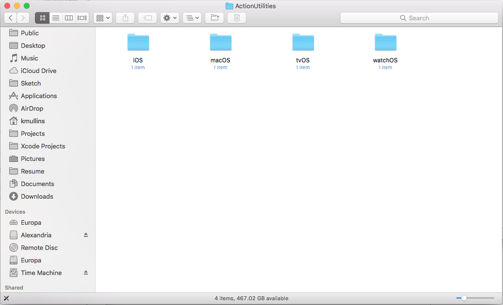

#Action Data Getting Started Guide

## Discover Action Data

Thank you for trying our [Action Data](http://appracatappra.com/products/action-data/) collection of time saving functions and utilities for working with data across wide range of mobile and desktop apps. We hope you enjoy using our components and that they become a valuable part of your developer environment. 

This guide is designed to help you get up and running with **Action Data** quickly and easily in your own app projects.

The following topics are covered:

* [Installing Action Data](#Installing-Action-Data)
* [Adding Action Data to an App Project](#Adding-Action-Data-to-an-App-Project)
* [Activating Your License](#Activating-Your-License)
* [Component Documentation](#Component-Documentation)
* [Frequently Asked Questions](#Frequently-Asked-Questions)
* [Getting Support](#Getting-Support)

<a name="Installing-Action-Data"></a>
## Installing Action Data

Before you can use the **Action Data** suite in your Xcode Swift app projects you will need to install the framework in the `/Library/Frameworks/ActionData/` directory of your development computer. Double-click the `ActionDataInstaller.pkg` file to start the installation process:


Follow the on-screen instruction to complete the install. 

<a name="Adding-Action-Data-to-an-App-Project"></a>
## Adding Action Data to an App Project

Our components were designed to be quickly added to your app's project with a minimum of code, making it easy to add high-quality, professional features and functionality to your apps.

**NOTICE:** In addition to adding the **Action Data** framework, you will need to add the required **Action Utilities** framework your Swift app projects. The **Action Utilities** framework was automatically installed along with the **Action Data** framework in the `/Library/Frameworks/` directory of your development computer.

In **Xcode**, do the following:

1. Open an app project or start a new one.
2. Select the **Project** in the **Project Navigator**, select the **General** tab and scroll down to the **Embedded Binaries** section:

	
3. In **Finder**, navigate to the `/Library/Frameworks/ActionUtilities/` directory :

	
4. Open the folder that matches the type of app that you are building (for example, `iOS` for an iOS app project) and drag the framework into the **Embedded Binaries** section in **Xcode**:

	
5. You can either choose to use the framework from its default location or copy it into your app's project (by selecting **Copy items if needed**). Click the **Finish** button to complete the install:

	
6. The framework will be added to both the **Embedded Binaries** and the **Linked Frameworks and Libraries** sections:

	
7. Repeat Steps 2-5 to add the **Action Data** framework.

You are now ready to use the **Action Data** suite in your app project. Include the `import ActionData` statement at the top of any class you want use a component from. For example:

```swift
import UIKit
import ActionUtilities
import ActionData

class ViewController: UIViewController {

    override func viewDidLoad() {
        super.viewDidLoad()
        // Do any additional setup after loading the view, typically from a nib.
        do {
        	try ADSQLiteProvider.shared.openSource("MyDatabase.db")
        	...
        } catch {
        	print("Unable to open database.")
        }
    }

    override func didReceiveMemoryWarning() {
        super.didReceiveMemoryWarning()
        // Dispose of any resources that can be recreated.
    }


}
```

<a name="Activating-Your-License"></a>
## Activating Your License

Before your copy of **Action Data** can be successfully used in any of your app projects, it will need to be activated using the [Activate License](http://appracatappra.com/checkout/activate-license/) form on the Appracatappra website. 

The activation process needs to only be done once and will result in an **Activation Key** that you will need to use with the `AppracatappraLicenseManager` built into the **Action Data** suite.

Failure to add your activation information to the `AppracatappraLicenseManager` **before** using any **Action Data** will result in the following Toast popup message being displayed:

> Unlicensed Appracatappra Product

Please see the **Activating Your License** documentation that shipped with your purchase for the full details. Trail versions of our frameworks do not require an Activation Key and can be used as-is in you app projects.

<a name="Component-Documentation"></a>
## Component Documentation

The [Action Data Developer Center](http://appracatappra.com/developers/action-data-developer/) was designed to help you get the most out of our developer tools by providing a selection of Articles, Guides, Samples and Quick Start References for each component in the suite.

Additionally, each tool in the **Action Data Suite** has a fully documented API, with comments for every element included:

* [iOS API Documentation](http://appracatappra.com/api/actiondata/ios/)
* [tvOS API Documentation](http://appracatappra.com/api/actiondata/tvos/)
* [macOS API Documentation](http://appracatappra.com/api/actiondata/macos/)

<a name="Frequently-Asked-Questions"></a>
## Frequently Asked Questions

The following is a list of frequently asked **Action Data** questions:

* **Can I use Action Data on multiple projects?**

	Yes, you are free to use our controls on as many mobile apps as you like. We do not place any restrictions on how many times you can download or use the components, nor do we limit the number of devices that you can install our components on.
* **Is Action Data royalty free?**

	Yes, you are free to use our controls in any app project, even those for your customers if you develop apps for other companies, without royalties.
* **Can I install Action Data on multiple development machines?**

	The short answer is yes, you can install your copy of Action Data on as many development machines that you own. That said, Action Data is sold on a per developer seat license. If you have multiple developers, each one will need to purchase their own individual copy of the components. Discounts are available on multi-seat purchase, please contact sales for more details. 
* **What does a year's subscription to Action Data provide?**

	**Action Data** is sold on a yearly license per developer seat. During your subscription period, you’ll receive any updates or bug fixes released during the year, free of charge. Additionally, you’ll receive any new UI control or time-saving feature added to the **Action Data** suite, again, free of charge, while your subscription is valid.
* **Will my Action Data stop working if I don't renew my license?**

	No, when you purchase a license to use **Action Data**, it is yours to keep forever and you can use it in as many projects as you like, royalty free. Your components will not stop working when your license expires and you will still be able to include them in new projects. However, you will no longer receive any new bug fixes, updates or feature enhancements so an update to iOS, tvOS, macOS, Swift or Xcode could potentially break compatibility with your component version.
	
* **What is your refund policy?**

	We offer no-questions-asked refunds to all customers within 30 days of your purchase. If you are not satisfied with our product, then simply send us an email and we will refund your purchase right away. Our goal has always been to create a happy, thriving community. If you are not thrilled with the product or are not enjoying the experience, then we have no interest in forcing you to stay an unhappy member.

<a name="Getting-Support"></a>
## Getting Support

Have a question about using one of our products, need to report or check on the status of a bug or need help implementing a tool in your app project? 

For faster support, answers to know issues and to get help from other users try the [Appracatappra Support Forums](http://appracatappra.com/community/).

Additionally, you can fill out our [Support Form](http://appracatappra.com/support/) and you’ll hear from a representative typically within one business day.