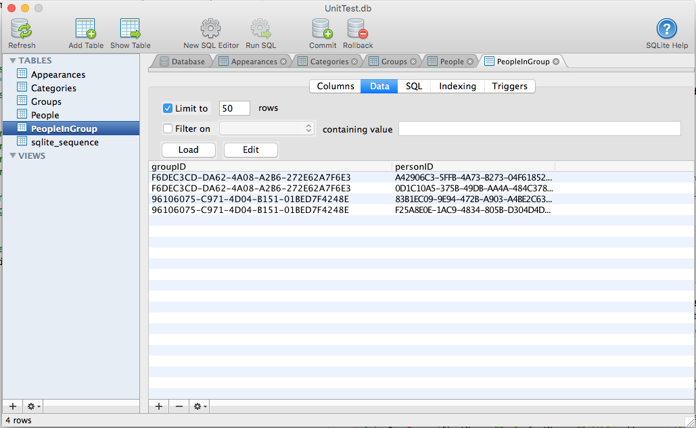

# Action Data for Swift

**Action Data** is a suite of backend controls designed to quickly and easily add support for several common databases and data formats (such as SQLite, JSON, XML and CloudKit) to your app.

**Action Data** provides both light weight, low-level access to the data sources along with high level **Object Relationship Management** (ORM) support (using Swift 4's new `Codable`, `Encodable` and `Decodable` protocols.

Created by developers, for developers. Appracatappra's controls are designed to be quickly added to your app's project with a minimum of code and effort, making it easy to add high-quality, professional features and functionality to your app without having to write tons of repetitive, boilerplate code.

## What's Included

**Action Data** adds the following functionality:

* [Action Data Binding](#Action-Data-Binding) - Allows you to bind values from a data model (any class or structure that conforms to the `Codable` protocol) to a `ADBoundViewController` and the controller will automatically populate any control that conforms to the `ADBindable` protocol with the values from the model.
* [Action Codable](#Action-Codable) - Uses Swift 4's new `Codable`, `Encodable` and `Decodable` protocols to move information between your data models and our portable `ADRecord` and `ADRecordSet` formats.
	* [Swift Portable Object Notation](#Swift-Portable-Object-Notation) - The new **Swift Portable Object Notation** (SPON) data format that allows complex data models to be encoded in a portable text string that encodes not only property keys and data, but also includes type information about the encoded data.
* [Action Data Providers](#Action-Data-Providers) - Provides light weight, low-level access and high-level **Object Relationship Management** (ORM) support to several common databases and data formats such as SQLite, JSON, XML, SPON and CloudKit.
* [Action SQL Parser](#Action-SQL-Parser) - Provides the ability to parse text containing one or more SQL commands into an **Action Data SQL Document Object Model** (DOM) and is used to provide SQL support for data sources that don't support SQL natively (such as CloudKit and JSON).
* [More Documentation](#More-Documentation-and-Use-Examples) - Visit the Appracatappra website for more information on Action Data and how to use it.

<a name="Action-Data-Binding"></a>
## Action Data Binding

A `ADBoundViewController` provides a method to attach it to a data model (any Swift class or structure that conforms to the `Codable` protocol) and any control conforming to the `ADBindable` protocol on any **View** or **SubView** will automatically be populated with the values from the data model based on the `dataPath` property of the control. The `dataPath` must match the name and case of a field on the attached data model or be a formula using a SQL like syntax.
 
By using the `setDataModel` function to set the model and automatically populate the fields, you to not need to create **Actions** or **Outlets** for the individual controls. The `ADBoundViewController` will automatically handle the reading and writing of properties for you.
 
For any `ADBindable` control that is editable, calling the `getDataModel` function will return the values from the controls on the **View** and **SubViews**. These will be written to the field of the data model as specified by the `dataPath` property of the control, as a result, a formula should not be used for the `dataPath` of any field that is readable.
 
For any field that requires onscreen keyboard support, the `ADBoundViewController` will automatically handle keyboard events such as moving fields hidden by the keyboard so they are visible and moving them back after they lose focus. Accessory tools can be automatically added to the keyboard to move between the text entry fields and to close the keyboard based on options for each control. These buttons can be customized using the `prevButtonText`, `prevButtonImage`, `nextButtonText`, `nextButtonImage`, `doneButtonText` and `doneButtonImage` properties of the `ADBoundViewController`.
 
The `ADBoundTextPicker` control has an embedded picker view that will be handled automatically by the `ADBoundViewController` in a similar fashion as th onscreen keyboard. If the field is covered by the picker, it will be moved automatically to be shown and moved back when the picker is closed. An accessory toolbar will be added to the picker that can be customized with the `cancelButtonText`, `cancelButtonImage`, `doneButtonText` and `doneButtonImage` properties of the `ADBoundViewController`.
 
## Example:
 
```swift
// Given the following class
class Category: ADDataTable {
 
	 enum CategoryType: String, Codable {
	     case local
	     case web
	 }
	 
	 static var tableName = "Categories"
	 static var primaryKey = "id"
	 static var primaryKeyType: ADDataTableKeyType = .computedInt
	 
	 var id = 0
	 var added = Date()
	 var name = ""
	 var description = ""
	 var enabled = true
	 var highlightColor = UIColor.white.toHex()
	 var type: CategoryType = .local
	 var icon: Data = UIImage().toData()
	 
	 required init() {
	 
	 }
}
 
// Populate any control on the View with values from the data model
let category = Category(name: "Swift File", description: "A file containing swift source code.")
do {
	try setDataModel(category)
} catch {
	print("Failed to set data model")
}
 
// Read the vaules back from the controls
do {
	let category = try getDataModel(Category.self)
	print("Category Description: \(category.description)")
} catch {
	print("Unable to read data model")
}
```

The following bindable controls are available:

* **ADBoundLabel** - Creates a label that can be bound to a value from a data model that conforms to the `Codable` protocol when placed on a `ADBoundViewController` view. Use the `dataPath` property to specify the field from the bound data model to populate the label from or supply a formula in a SQL like syntax.
* **ADBoundTextField** - Creates a text field that can be bound to a value from a data model that conforms to the `Codable` protocol when placed on a `ADBoundViewController` view. Use the `dataPath` property to specify the field from the bound data model to populate the text field from or use a formula in a SQL like syntax.
* **ADBoundSlider** - Creates a slider that can be bound to a value from a data model that conforms to the `Codable` protocol when placed on a `ADBoundViewController` view. Use the `dataPath` property to specify the field from the bound data model to populate the slider's value from or use a formula in a SQL like syntax.
* **ADBoundSwitch** - Creates a switch that can be bound to a value from a data model that conforms to the `Codable` protocol when placed on a `ADBoundViewController` view. Use the `dataPath` property to specify the field from the bound data model to populate the switch from or a formula in a SQL like syntax.
* **ADBoundProgressView** - Creates a progress view that can be bound to a value from a data model that conforms to the `Codable` protocol when placed on a `ADBoundViewController` view. Use the `dataPath` property to specify the field from the bound data model to populate the progress from or a formula in a SQL like syntax.
* **ADBoundStepper** - Creates a stepper that can be bound to a value from a data model that conforms to the `Codable` protocol when placed on a `ADBoundViewController` view. Use the `dataPath` property to specify the field from the bound data model to populate the stepper's value from or a formula in a SQL like syntax.
* **ADBoundImageView** - Creates an image view that can be bound to a value from a data model that conforms to the `Codable` protocol when placed on a `ADBoundViewController` view. Use the `dataPath` property to specify the field from the bound data model to populate the image view from or a formula in a SQL like syntax.
* **ADBoundTextView** - Creates a text view that can be bound to a value from a data model that conforms to the `Codable` protocol when placed on a `ADBoundViewController` view. Use the `dataPath` property to specify the field from the bound data model to populate the text view from or a formula in a SQL like syntax.
* **ADBoundWebView** - Creates a web view that can be bound to a value from a data model that conforms to the `Codable` protocol when placed on a `ADBoundViewController` view. Use the `dataPath` property to specify the field from the bound data model to use as the URL or the HTML data to display in the web view. Use the `containsHTML` property to decide if the `dataPath` contains a `URL` or `HTML` data.
* **ADBoundSegmentedControl** - Creates a segmented control that can be bound to a value from a data model that conforms to the `Codable` protocol when placed on a `ADBoundViewController` view. Use the `dataPath` property to specify the field from the bound data model to select the segment from or use a formula in a SQL like syntax. Use the `byTitle` property to decide if the segment is selected by title or integer position.
* **ADBoundTextPicker** - Creates a text field that can be bound to a value from a data model that conforms to the `Codable` protocol when placed on a `ADBoundViewController` view. Use the `dataPath` property to specify the field from the bound data model to populate the text field from or use a formula in a SQL like syntax. Includes a builtin picker control used to select the value from a list of available values.


<a name="Action-Codable"></a>
## Action Codable
 
**Action Codable** controls provide support for several common databases and data formats such as SQLite, JSON, XML and CloudKit using Swift 4's new `Codable`, `Encodable` and `Decodable` protocols to move information between your data models and our portable `ADRecord` and `ADRecordSet` formats.
 
With **Action Codable** and **Action Data Providers**, build your data model objects as simple `struct` or `class` objects and inherit from `ADDataTable`, then use **Action Controls** to quickly create, insert, update, delete and maintain the tables and records in the underlying data source. For example:

```swift
import Foundation
import ActionUtilities
import ActionData

class Category: ADDataTable {
    
    enum CategoryType: String, Codable {
	    case local
	    case web
	}
    
    static var tableName = "Categories"
    static var primaryKey = "id"
    static var primaryKeyType: ADDataTableKeyType = .computedInt
    
    var id = 0
    var added = Date()
    var name = ""
    var description = ""
    var enabled = true
    var highlightColor = UIColor.white.toHex()
    var type: CategoryType = .local
    var icon: Data = UIImage().toData()
    
    required init() {
        
    }
}
```

This includes support for complex tables with nested objects, arrays and dictionaries and complex relationships such as one-to-one, one-to-many and many-to-many. For example:

```swift
import Foundation
import ActionUtilities
import ActionData

struct Address: Codable {
    var addr1 = ""
    var addr2 = ""
    var city = ""
    var state = ""
    var zip = ""
}

class Person: ADDataTable {
    
    static var tableName = "People"
    static var primaryKey = "id"
    static var primaryKeyType = ADDataTableKeyType.autoUUIDString
    
    var id = UUID().uuidString
    var firstName = ""
    var lastName = ""
    var addresses: [String:Address] = [:]
    
    required init() {
        
    }
    
    init(firstName: String, lastName:String, addresses: [String:Address] = [:]) {
        self.firstName = firstName
        self.lastName = lastName
        self.addresses = addresses
    }
}

class Group: ADDataTable {
    
    static var tableName = "Groups"
    static var primaryKey = "id"
    static var primaryKeyType = ADDataTableKeyType.autoUUIDString
    
    var id = UUID().uuidString
    var name = ""
    var people = ADCrossReference<Person>(name: "PeopleInGroup", leftKeyName: "groupID", rightKeyName: "personID")
    
    required init() {
        
    }
    
    init(name: String, people: [Person] = []) {
        self.name = name
        self.people.storage = people
    }
}
```
<a name="Swift-Portable-Object-Notation"></a>
### Swift Portable Object Notation

**Action Codable** also introduces support for the new **Swift Portable Object Notation** (SPON) data format that allows complex data models to be encoded in a portable text string that encodes not only property keys and data, but also includes type information about the encoded data. For example, using the `Address` struct above:

```swift
@obj:Address<state$=`TX` city$=`Seabrook` addr1$=`25 Nasa Rd 1` zip$=`77586` addr2$=`Apt #123`>
```
The portable, human-readable string format encodes values with a single character _type designator_ as follows:
     
* `%` - Bool
* `!` - Int
* `$` - String
* `^` - Float
* `&` - Double
* `*` - Embedded `NSData` or `Data` value
     
Additionally, embedded arrays will be in the `@array[...]` format and embedded dictionaries in the `@obj:type<...>` format.

<a name="Action-Data-Providers"></a>
### Action Data Providers

**Action Data Providers** provide light weight, low-level access to several common databases and data formats such as SQLite, JSON, XML, SPON and CloudKit. Results are returned as a key/value dictionary (`ADRecord`) or as an array of key/value dictionaries (`ADRecordSet`). For example:

```swift
let provider = ADSQLiteProvider.shared
let record = try provider.query("SELECT * FROM Categories WHERE id = ?", withParameters: [1])
print(record["name"])
```

Additionally, **Action Data Providers** provide high-level **Object Relationship Management** (ORM) functionality using **Action Codable** controls and data models conforming to the `ADDataTable` protocol. For example, using the `Address`, `Person` and `Group` data models presented above:

```swift
let addr1 = Address(addr1: "PO Box 1234", addr2: "", city: "Houston", state: "TX", zip: "77012")
let addr2 = Address(addr1: "25 Nasa Rd 1", addr2: "Apt #123", city: "Seabrook", state: "TX", zip: "77586")
    
let p1 = Person(firstName: "John", lastName: "Doe", addresses: ["home":addr1, "work":addr2])
let p2 = Person(firstName: "Sue", lastName: "Smith", addresses: ["home":addr1, "work":addr2])
    
let group = Group(name: "Employees", people: [p1, p2])
try provider.save(group)
```

Creates the `People`, `Group` and `PeopleInGroups` SQLite database tables (if required) and inserts the new record instances, with relationships, into the database. For example:



To retrieve the `Group` from the database, use the following:

```swift
let group = try provider.getRow(ofType: Group.self, forPrimaryKeyValue: "F6DEC3CD-DA62-4A08-A2B6-272E62A7F6E3")
```

The **Action Data Providers** are designed to be interchangeable, so you can start developing locally using a SQLite database and a `ADSQLiteProvider`, then later switch to CloudKit and a `ADCloudKitProvider` without have to change any of your other code.

Additionally, **Action Data Providers** can be used to move data from one source to another. For example, download data from the web in JSON using a `ADJSONProvider` and save it to a local SQLite database using a `ADSQLiteProvider`, all with a minimal of code.

Several of our **Action Controls** are designed to take an **Action Data Provider** as input (such as **ActionTable**), making it easy to work with complex data and common display and input methodologies that would typically require tons of repetitive, boilerplate code.

<a name="Action-SQL-Parser"></a>
## Action SQL Parser

The `ADSQLParser` provides the ability to parse text containing one or more SQL commands into an **Action Data SQL Document Object Model** (DOM) and is used to provide SQL support for data sources that don't support SQL natively (such as CloudKit and JSON).

The `ADSQLParser` uses SQLite's SQL syntax and currently support a subset of the full SQL language. For example:

```swift
let sql = """
CREATE TABLE IF NOT EXISTS parts
(
	part_id           INTEGER   PRIMARY KEY,
	stock             INTEGER   DEFAULT 0   NOT NULL,
	description       TEXT      CHECK( description != '' )    -- empty strings not allowed
);
"""

let instructions = try ADSQLParser.parse(sql)
print(instructions)
```

<a name="More-Documentation-and-Use-Examples"></a>
## More Documentation and Use Examples

More documentation and usages examples are available on the Appracatappra website under [Action Data](http://appracatappra.com/products/action-data/) and in the [Action Data Developer Center](http://appracatappra.com/developers/action-data-developer/?et_fb=1&PageSpeed=off).