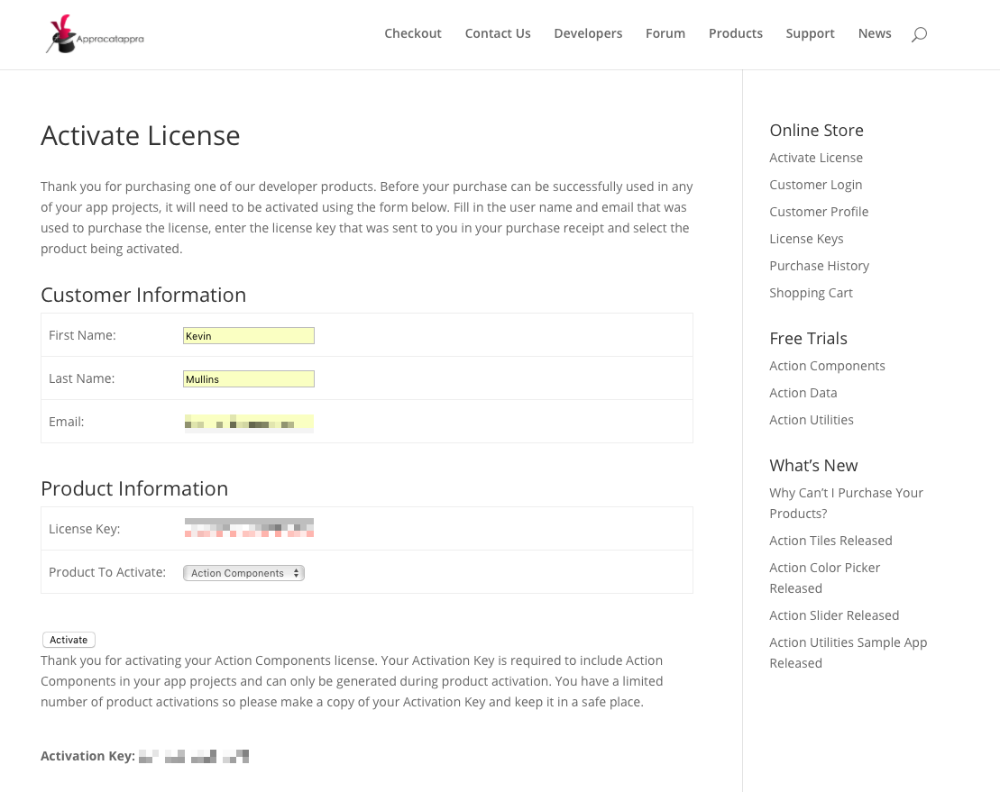

# Activating Your Action Data License

Thank you for purchasing our [Action Data](http://appracatappra.com/products/action-data/) suite of backend controls designed to quickly and easily add support for several common databases and data formats (such as SQLite, JSON, XML and CloudKit) to your iOS, tvOS or macOS apps. We hope you enjoy using our components and that they become a valuable part of your developer environment. 

Before your copy of **Action Data** can be successfully used in any of your app projects, it will need to be activated using the [Activate License](http://appracatappra.com/checkout/activate-license/) form on the Appracatappra website. 

The activation process needs to only be done once and will result in an **Activation Key** that you will need to use with the `AppracatappraLicenseManager` built into the **Action Components** suite.

Failure to add your activation information to the `AppracatappraLicenseManager` **before** using any **Action Component** will result in the following Toast popup message being displayed:

> Unlicensed Appracatappra Product

The following topics are covered:

* [Activating Your License](#Activating-Your-License)
* [Adding Your License to an App Project](#Adding-Your-License-to-an-App-Project)


<a name="Activating-Your-License"></a>
## Activating Your License

To generate your key, visit [Activate License](http://appracatappra.com/checkout/activate-license/) and fill out the following form:


The Customer and Product Information **must _exactly_** match (all fields are case sensitive) the information provided when the product was purchased. You can get your Customer Information from the purchase receipt that was emailed to you or by visiting our [Customer Profile](http://appracatappra.com/checkout/customer-profile/) page:


You can find the Product Information on the purchase receipt that was emailed to you or by visiting [Purchase History](http://appracatappra.com/checkout/purchase-history/) page:


Click on the **View Details and Downloads** link to view the details of the purchase:


With the form correctly filled in, click the **Activate** button to generate your **Activation Key**:



Copy the **Activation Key** and store it in a safe place, you'll need it for any app project that uses **Action Components**. This key is only generated during product activation and you have a limited number of activations. To check on the number of activations, visit our [License Keys](http://appracatappra.com/checkout/license-keys/) page:


<a name="Adding-Your-License-to-an-App-Project"></a>
## Adding Your License to an App Project

With your **Activation Key** generated and your product marked as **Active** in the [License Keys](http://appracatappra.com/checkout/license-keys/) page, you'll need to set the **License Information** in the `AppracatappraLicenseManager` before any calls are made to an **Action Data** component. This is typically done in the `xxx` method of the `xxx.swift` file before the app starts for iOS. For example:

```swift
TODO: Add code
```

The Customer and Product Information provided to the `AppracatappraLicenseManager` **must _exactly_** match (all fields are case sensitive) the information provided when the product was activated above. 

Failure to add your activation information to the `AppracatappraLicenseManager` (or providing invalid information) will result in the following Toast popup message being displayed:

> Unlicensed Appracatappra Product

If you are having issues activating your product license, please contact [Customer Support](http://appracatappra.com/support/).